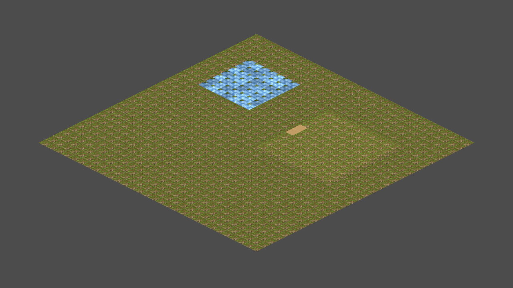
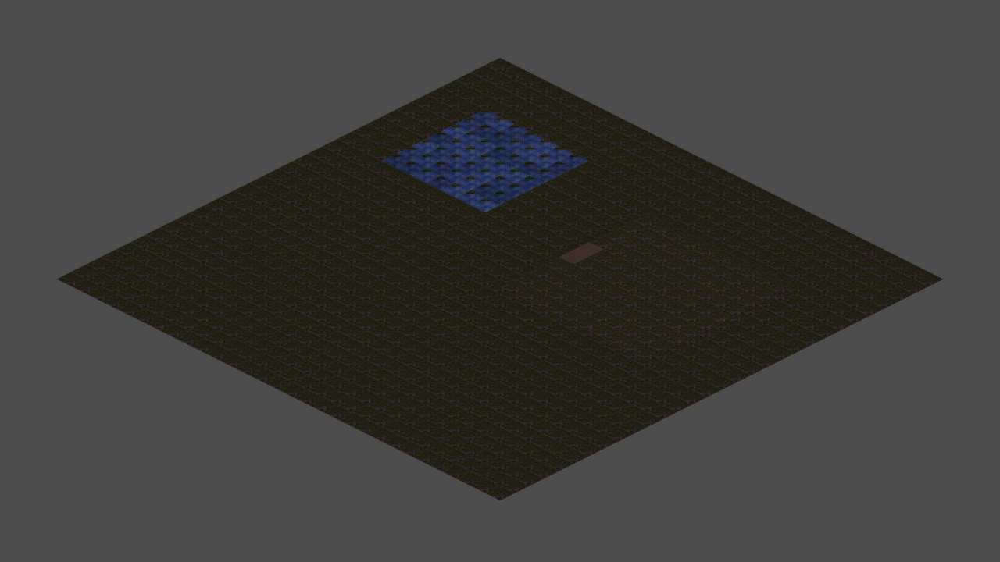
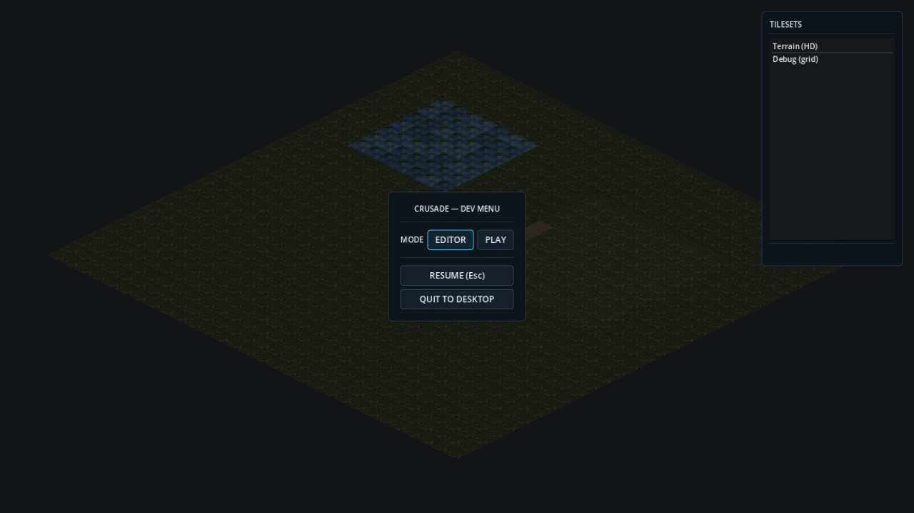

# Crusade — Isometric Map Engine & Editor Framework

[](https://github.com/saman-mb/crusade-rts/actions/workflows/ci.yml)

> **Codename:** Crusade (`crusade-rts`)

A high-performance 2D isometric map runtime and in-game editor built in **Godot 4.4.1**.

The goal is a polished, modern look and feel — think a **2D isometric StarCraft II**:
high-resolution sprites, crisp 2:1 diamond projection, a smooth RTS camera, animated
terrain, dynamic day/night lighting, and a fast in-game editing loop for iterating on
tilesets and layouts.

## Status

The engine foundation is built and merged on `main`. What runs today:

- **Multi-layer isometric map system** — stacked elevation tiers (`MapConstants.TIER_COUNT`),
  Y-sorted, with per-tier elevation offsets derived from a single source of truth.
- **Programmatic HD TileSet + animated water** — a code-built isometric TileSet with
  dual-grid autotiling and a 4-frame animated water tile (Story #3).
- **In-game map editor** — live paint / erase / eyedropper / bucket-fill, a hover ghost,
  a command-pattern undo/redo stack, and elevation-layer switching (Stories #4, #9).
- **Serialization & load/save** — a versioned JSON map schema, a validator, an up-migrator,
  and atomic crash-safe saves, wired to F6 save / F5 reload (Stories #5, #7; hardening
  #39–#45). See `docs/SERIALIZATION.md`.
- **In-game dev menu** — Esc pause overlay with Editor/Play mode switching and a live
  tileset swapper (Story #6).
- **Coordinate & projection core** — camera-safe, edge-robust screen→cell picking math
  (Story #8).
- **Multi-level navigation** — a pure nav-mesh / portal-graph library with cross-tier
  ramp transitions (Story #10), driven by the movement layer below.
- **Continuous unit movement (V3)** — flow-field group movement, formation assignment,
  A* single-unit paths, marquee multi-select, and steering/separation, exercised by the
  `unit_debug` dev hook. (Ramp-traversal polish is the one open follow-up.)
- **Day/night + directional lighting** — an ambient day/night cycle, a directional sun
  light with a normal-mapped terrain atlas, and per-tier elevation shading (Stories
  L1–L4). See `docs/LIGHTING.md`.
- **Foundation hardening** — a `map_changed` signal hub the camera clamp subscribes to,
  `class_name`-typed system nodes, and an authoritative tier count.

**Not built yet:** combat, economy/production, fog of war, AI, and the HUD/frontend.
Those are scoped as gap-filling epics **#133–#142** and are not implemented on `main`.

## Screenshots

> Rendered from the bundled showcase map (`assets/maps/showcase.json`).


*HD isometric terrain: dual-grid autotiled grass, an animated water lake, and a raised
elevation tier connected by a ramp.*


*Day/night lighting: an ambient cycle plus a directional sun and normal-mapped relief,
with higher tiers catching more light.*


*The Esc dev menu: Editor/Play mode switching and a live tileset swapper.*

## Getting Started

**Requires [Godot 4.4.1](https://godotengine.org/) exactly** (the version CI pins in
`.github/workflows/ci.yml`; `project.godot` declares the `4.4` feature line). No C#/.NET
— the project is pure GDScript.

1. Clone the repo and open it in Godot 4.4.1 (import `project.godot`), **or** launch it
   headfirst from the command line.
2. Press **Play** (F5 in the Godot editor). The main scene is
   `res://src/nodes/map_system.tscn` (from `run/main_scene`).
3. On first run there is no saved user map yet, so the engine loads the bundled
   **showcase map** (`assets/maps/showcase.json`) — a small multi-tier map with water and
   a ramp — instead of opening on an empty void. Once you save with F6, your map at
   `user://maps/dev_map.json` takes over on subsequent runs.

Run it from the command line without the editor:

```bash
godot --path . src/nodes/map_system.tscn
```

### Running the tests

CI imports the project, then runs every pure-core test. Reproduce it locally from the
repo root (see `.github/workflows/ci.yml` for the authoritative version):

```bash
# Fresh import (regenerates the class cache), then run every core test suite.
rm -rf .godot
godot --headless --path . --import
for t in src/core/tests/test_*.gd; do
  godot --headless --path . --script "res://$t"
done
```

Each suite prints a `PASS n / FAIL m` summary. See [CONTRIBUTING.md](CONTRIBUTING.md) for
the full pass/fail contract and the pure-core-vs-runtime-node testing rule.

## Controls

The main scene runs as a dev harness: an in-game map editor, a unit-movement debug hook,
and dev save/load all share the same window. The Esc dev menu toggles **Editor** mode
(painting on) and **Play** mode (painting off).

| Input | Action |
|-------|--------|
| **W A S D** / **Arrow keys** | Pan the camera |
| **Mouse wheel** | Zoom in / out (cursor-anchored) |
| **Middle-mouse drag** | Drag-pan the camera |
| Screen edges | Edge-scroll pan |
| **Esc** | Toggle the dev menu (pause + Editor/Play switch + tileset swapper) |
| **F6** | Save the current map to `user://maps/dev_map.json` (atomic) |
| **F5** | Reload the map from disk |
| **`,`** / **`.`** | Hold to scrub the time of day for a live lighting preview |
| **Left-click / drag** *(Editor mode)* | Paint the active tile |
| **Right-click / drag** *(Editor mode)* | Erase |
| **B** / **I** / **G** | Brush / eyedropper / bucket-fill tool |
| **Ctrl+Z** / **Ctrl+Y** (or **Ctrl+Shift+Z**) | Undo / redo |
| **`[`** / **`]`** | Switch the active elevation layer (editor) |
| **1** / **2** / **3** | Jump to elevation tier 0 / 1 / 2 |
| **S** *(unit hook)* | Spawn a unit at the cursor on the active tier |
| **Left-click** *(unit hook)* | Select the unit under the cursor (empty cell clears) |
| **Left-drag** *(unit hook)* | Marquee multi-select (**Shift** = add to selection) |
| **Right-click** *(unit hook)* | Move order — single-unit A* path, or a group formation flow for ≥2 units |

> The unit-movement controls come from `src/nodes/unit_debug.gd`; the editor controls
> from `src/editor/map_editor.gd`. Left/right mouse resolve to editor paint/erase in
> Editor mode and to unit select/move in Play mode.

## TileSets & Animated Tiles

Terrain rendering is driven by a programmatically built TileSet — no `.tres` is
hand-authored in the editor, so the whole thing is constructible headlessly and
diff-reviewable in code.

- **Isometric geometry.** The TileSet is `TILE_SHAPE_ISOMETRIC` +
  `TILE_LAYOUT_DIAMOND_DOWN` with a `128x64` true 2:1 HD diamond tile. Geometry comes
  from `MapConstants.TILE_SIZE` (the single source of truth); the atlas layout (region
  size, atlas dimensions, lookup table) lives in `TileSetConstants`.
  `TileSetBuilder.build_terrain_tileset(texture)` assembles the atlas source, one tile
  per distinct dual-grid coord, the water tile, and the ramp tile.
- **Animated water.** The water tile is a 4-frame strip at `0.2s`/frame (~5 fps) using
  `TILE_ANIMATION_MODE_RANDOM_START_TIMES`, so neighbouring water tiles desync instead
  of rippling in lockstep.
- **Per-cell variation, no visible grid.** A solid-grass field would otherwise read as one
  tile stamped on a lattice. Two systems break that up: the interior grass tile carries four
  flip-orientation `alternative_tile`s and a deterministic per-cell picker (`VariationPicker`
  → stable across save/load, applied by `TerrainVariation`) so adjacent cells stop looking
  identical; and a low-frequency world-space noise shader (`terrain_tint.gdshader`) drifts
  brightness and hue smoothly across the whole map — continuous variation with no tile
  boundary, unlike a per-tile tint (Stories #232, #233).
- **Dual-grid autotiling.** Clean SC2-style edges come from a dual grid: the display grid
  is offset half a tile from the logical grid, so each drawn tile straddles 4 logical
  cells whose filled/empty states form a 4-bit corner mask (16 states → 15 non-empty
  tiles). This is our own pure integer-space `DualGrid` core (`src/core/dual_grid.gd`) —
  a deliberate choice over the `TileMapDual` editor plugin, so the logic stays testable,
  Node-free, and decoupled from editor tooling.
- **HD render settings.** The look relies on Forward+ rendering, MSAA 2D 2x, Linear
  texture filtering, and 2D pixel snapping OFF (see `[rendering]` in `project.godot`).

See `docs/TILESET_ATLAS.md` for the full atlas layout.

## Terrain art & the atlas packer

The terrain atlas at `assets/tilesets/terrain_atlas.png` is **real CC0 art**, not a
placeholder. It is composited deterministically from the vendored CC0 source sheets in
`assets/tilesets/sources/` (Screaming Brain Studios, "1000+ Isometric Floor Tiles",
CC0) by `tools/pack_terrain_atlas.py`, which blends grass over dirt through the exact
dual-grid corner-triangle geometry and builds the animated water strip. The interior grass
is the average of several grass-dominant source cells with its contrast flattened, so no
single blade "signature" survives to read as a stamp, and the diamond silhouette is hardened
so neighbouring tiles meet at full coverage instead of leaving a seam of void (Story #233).
A paired tangent-space normal map (`terrain_atlas_n.png`) is generated by
`tools/gen_normal_atlas.py` so the sun light shades the diamonds with relief.

Regenerate the atlas from the CC0 sources:

```bash
python3 tools/pack_terrain_atlas.py
```

Full provenance and licensing are in [CREDITS.md](CREDITS.md) and
`assets/tilesets/sources/SOURCE.txt`. (A separate `tools/gen_placeholder_atlas.py` exists
only to produce a flat-shaded debug atlas; it is **not** what ships.)

## Directory Layout

```
res://
├── src/
│   ├── core/       # pure RefCounted libraries (map system math, serialization,
│   │   │           #   autotiling, nav mesh, steering) + unit tests
│   │   └── tests/  # headless test_*.gd suites (run by CI)
│   ├── editor/     # in-game editor node, brushes, flood-fill, undo/redo
│   ├── nodes/      # runtime scene nodes (map system, camera, persistence,
│   │               #   day/night, sun, units) and their .tscn scenes
│   └── ui/         # in-game dev menu overlay + theme
├── assets/
│   ├── tilesets/   # committed terrain atlas + normal map; CC0 sources/
│   └── maps/       # bundled maps (showcase.json first-run map)
├── tools/          # Python asset tooling (atlas packer, normal-map generator)
└── docs/           # subsystem write-ups (serialization, lighting, atlas, sorting)
```

Architecture note: `src/core/*` is pure and CI-tested; `src/nodes/*`, `src/editor/*`,
and `src/ui/*` are runtime and only parsed by CI. See [CONTRIBUTING.md](CONTRIBUTING.md).

## Engine

- **Godot 4.4.1** (Forward+ renderer)
- `TileMapLayer`-based stacked elevation layers with Y-Sort

## License

MIT — see [LICENSE](LICENSE). Bundled third-party art is CC0; see [CREDITS.md](CREDITS.md).
